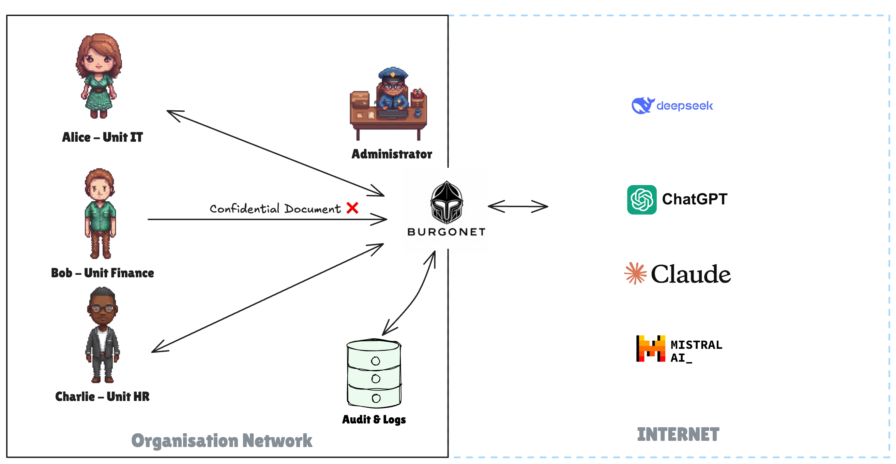
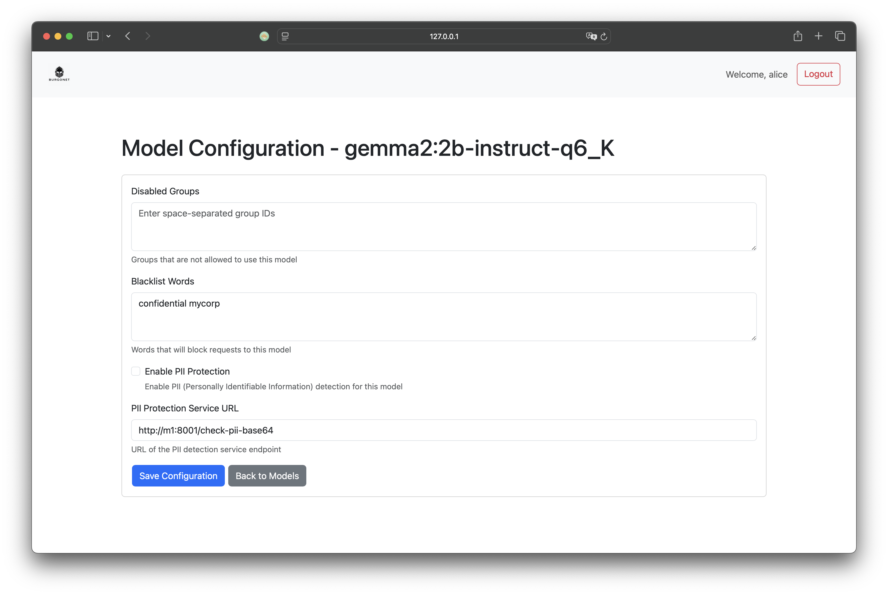

# Welcome to Burgonet Gateway Documentation

Burgonet Gateway is an enterprise LLM gateway that provides secure access and compliance controls for AI systems.

> ⚠️ This project is still under active development

## Quick Links
- [Getting Started](#getting-started)
- [Core Features](#core-features)
- [Use Cases](#use-cases)
- [Technical Architecture](#technical-architecture)
- [Configuration](#configuration)
- [API Reference](#api-reference)

## Getting Started
Learn how to set up and configure Burgonet Gateway for your organization.

## Core Features
- **Access Control**: Granular permissions for users and groups
- **Quota Management**: Set usage limits per user/group
- **Content Filtering**: PII detection and keyword blocking
- **Audit Logging**: Detailed request/response tracking
- **Multi-Provider Support**: OpenAI, DeepSeek, Ollama, and more

## Use Cases
Explore common scenarios and configurations:

- [Departmental Access Control](#departmental-access-control)
- [Cost Management with Quotas](#cost-management)
- [Preventing Data Leakage](#data-leakage-prevention)

### Departmental Access Control
Let's consider an organization with three departments:

| Department | Access Level | Restrictions |
|------------|--------------|--------------|
| IT         | All models   | Quotas & rate limits |
| Finance    | Self-hosted only | No external models |
| HR         | All models   | Unlimited budget |




- Alice works in the IT Department
- Bob works in the Finance Department
- Charlie works in the Human Resources Department

The organization's governance rules are configured as follows:

- The IT Department has access to all models, with quotas and rate limits
- The Finance Department does not have access to external models only self-hosted.
- The Human Resources Department has access to all models with unlimited budget


## Use case: restrict group access 
	⚠️ Implemented, to be documented 

## Use case: restrict keywords
	⚠️ Implemented, to be documented 




## Use case: prevent leakage of personal idenfier & information leak

```bash
curl http://127.0.0.1:8080/ollama/gemma2/2b/ -i  \
-H "Authorization: Bearer your-token-here" \
-d '{
  "model": "gemma2:2b-instruct-q6_K",                                                                                                                        "messages": [
    {
      "role": "user",
      "content": "Hi my name is Jean-Claude Dusse"
    }
  ] ,
  "stream": false
}'
HTTP/1.1 403 Forbidden
Server: openresty/1.21.4.1
Date: Thu, 16 Jan 2025 13:01:06 GMT
Content-Type: text/plain
Transfer-Encoding: chunked
Connection: keep-alive

Request contains sensitive personal information
```

## Use Case: Cost Management with Quotas

Administrators can effectively control costs by configuring **quotas** for model usage and user access.

### Key Features:

- **Per-Model Quotas**: Set usage limits for individual models to manage resource allocation.

This granular approach allows administrators to optimize costs while maintaining flexibility and control over system resources.


```json
        {
            "provider": "ollama",
            "model_name": "gemma2:2b-instruct-q6_K",
            "location": "/ollama/gemma2/2b/",
            "proxy_pass": "http://m1:11434/api/chat",
            "api_key": "NA",
            "disabled_groups": "",
            "blacklist_words": "confidential mycorp",
            "pii_protection_url": "http://m1:8001/check-pii-base64",
            "quotas": {
                "max_tokens": {"week": 100000,
                               "day": 1000,
                               "hour": 50},
        
            }
        }
```


