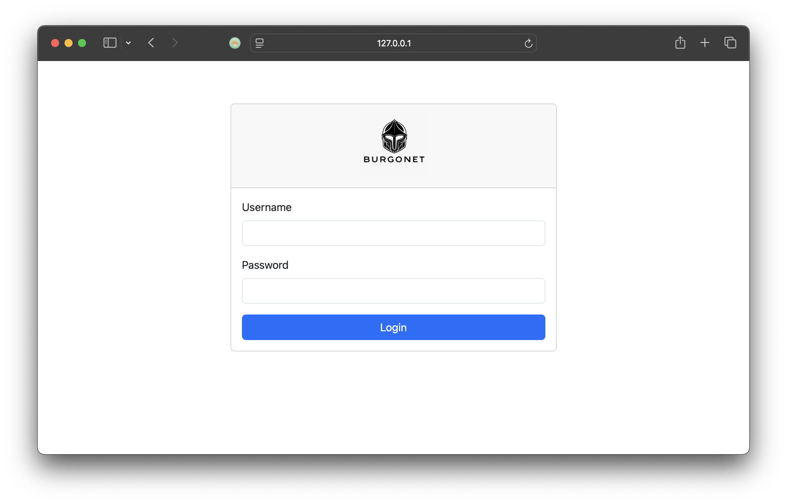
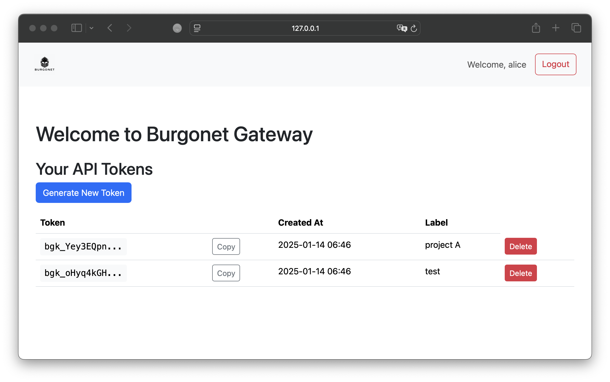
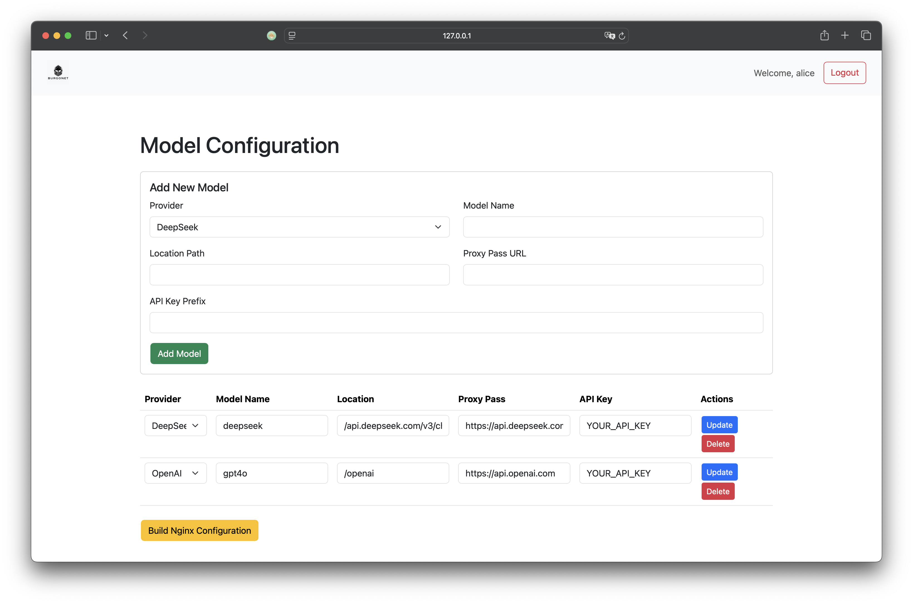

# Walk the talk









## Log example

```json
{
  "time_local": "14/Jan/2025:11:06:14 +0000",
  "remote_addr": "192.168.65.1",
  "remote_user": "",
  "request": "POST /api.deepseek.com/v3/chat/completions HTTP/1.1",
  "status": "200",
  "body_bytes_sent": "440",
  "request_time": "1.977",
  "http_referrer": "",
  "http_user_agent": "curl/8.7.1",
  "http_x_forwarded_for": "",
  "host": "localhost",
  "authorization": "Bearer your-token-here",
  "upstream_addr": "104.18.27.90:443",
  "request_method": "POST",
  "http_version": "HTTP/1.1",
  "request_body": "{\n        \"model\": \"deepseek-chat\",\n        \"messages\": [\n          {\"role\": \"system\", \"content\": \"You are a helpful assistant.\"},\n          {\"role\": \"user\", \"content\": \"Hello\"}\n        ],\n        \"stream\": false\n      }",
  "response_body": "{\"id\":\"08118b43-3ec7-4691-b3c9-91bb5e1cbe23\",\"object\":\"chat.completion\",\"created\":1736852773,\"model\":\"deepseek-chat\",\"choices\":[{\"index\":0,\"message\":{\"role\":\"assistant\",\"content\":\"Hello! How can I assist you today? 😊\"},\"logprobs\":null,\"finish_reason\":\"stop\"}],\"usage\":{\"prompt_tokens\":10,\"completion_tokens\":11,\"total_tokens\":21,\"prompt_cache_hit_tokens\":0,\"prompt_cache_miss_tokens\":10},\"system_fingerprint\":\"fp_3a5770e1b4\"}",
  "provider": "deepseek",
  "model_name": "deepseek",
  "model_version": "v3"
}
```

