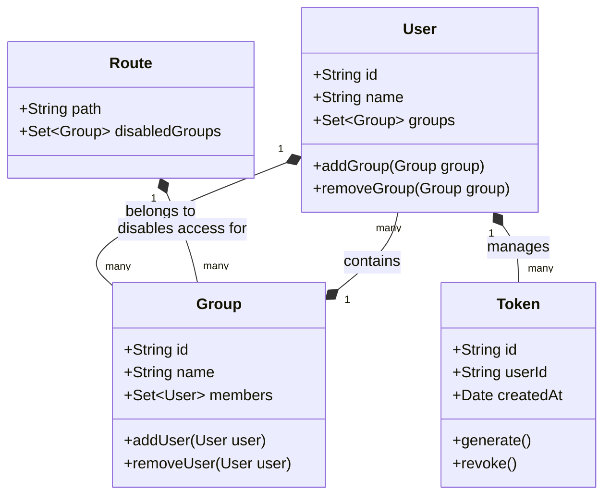

## Concept relations

```mermaid
classDiagram
    class User {
        +String id
        +String name
        +Set~Group~ groups
        +addGroup(Group group)
        +removeGroup(Group group)
    }

    class Group {
        +String id
        +String name
        +Set~User~ members
        +addUser(User user)
        +removeUser(User user)
    }

    class Route {
        +String path
        +Set~Group~ disabledGroups
    }


    class Token {
        +String id
        +String userId
        +Date createdAt
        +generate()
        +revoke()
    }

    User "1" *-- "many" Group : belongs to
    Group "1" *-- "many" User : contains
    User "1" *-- "many" Token : manages
    Route "1" *-- "many" Group : disables access for
```

