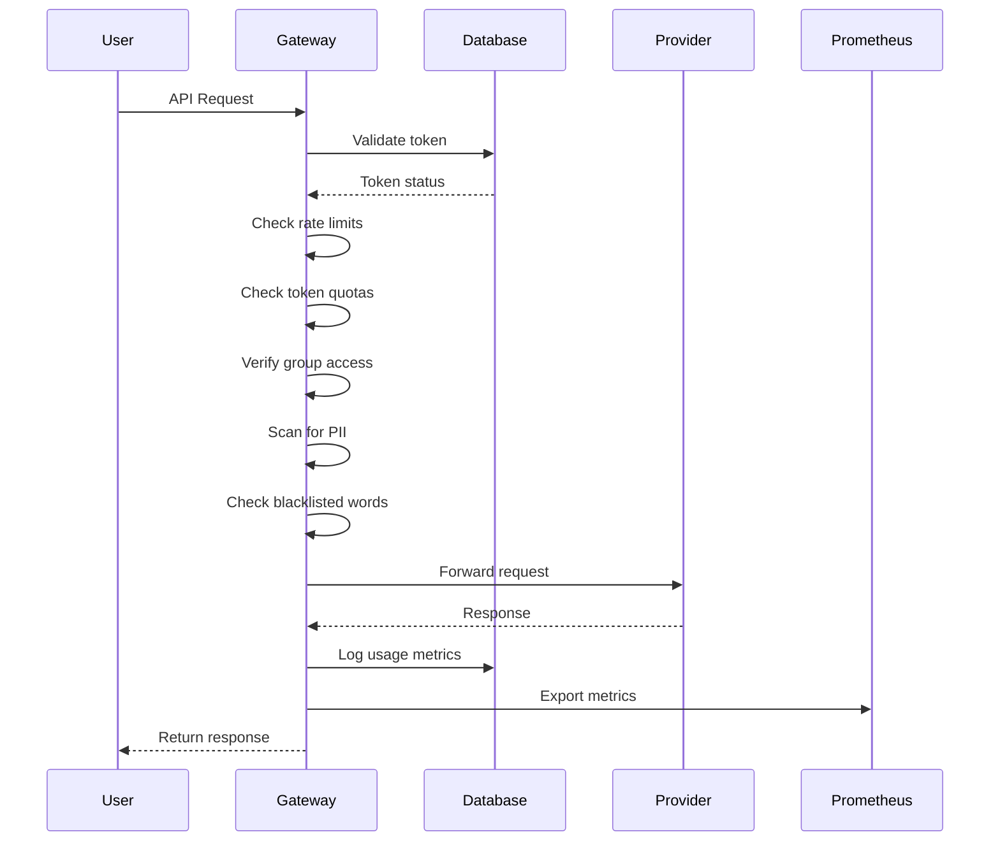
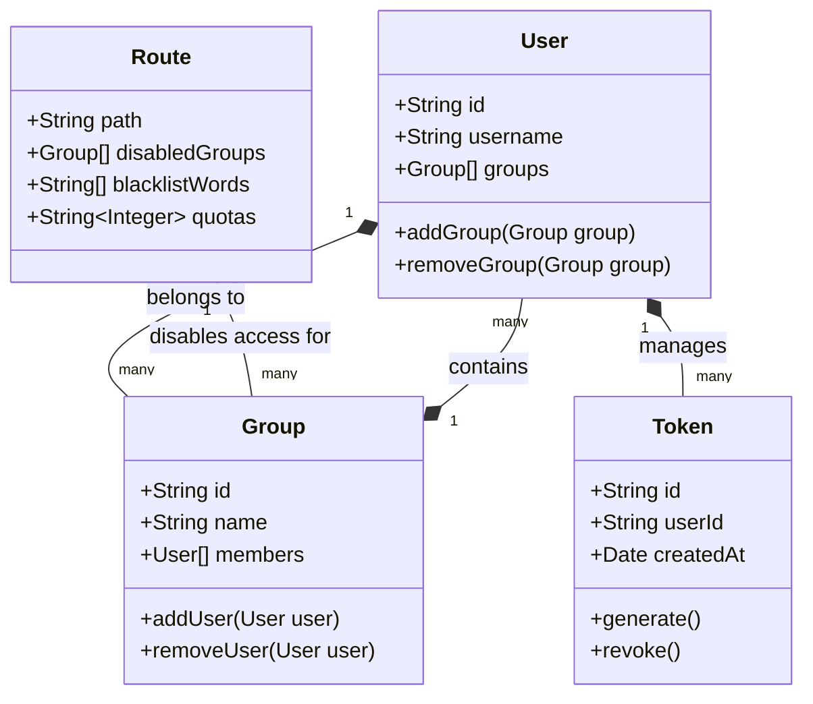

# Technical Architecture

## System Components

## Request Flow

```mermaid
sequenceDiagram
    participant User
    participant Gateway
    participant Database
    participant Provider
    
    User->>Gateway: API Request
    Gateway->>Database: Validate token
    Database-->>Gateway: Token status
    Gateway->>Gateway: Check rate limits
    Gateway->>Gateway: Check token quotas
    Gateway->>Gateway: Verify group access
    Gateway->>Gateway: Scan for PII
    Gateway->>Gateway: Check blacklisted words
    Gateway->>Provider: Forward request
    Provider-->>Gateway: Response
    Gateway->>Database: Log usage metrics
    Gateway->>Prometheus: Export metrics
    Gateway-->>User: Return response
```

## Core Concepts

```mermaid
classDiagram
    class User {
        +String id
        +String username
        +Group[] groups
        +addGroup(Group group)
        +removeGroup(Group group)
    }

    class Group {
        +String id
        +String name
        +User[] members
        +addUser(User user)
        +removeUser(User user)
    }

    class Token {
        +String id
        +String userId
        +Date createdAt
        +generate()
        +revoke()
    }

    class Route {
        +String path
        +Group[] disabledGroups
        +String[] blacklistWords
        +String~Integer~ quotas
    }

    User "1" *-- "many" Group : belongs to
    Group "1" *-- "many" User : contains
    User "1" *-- "many" Token : manages
    Route "1" *-- "many" Group : disables access for
```
