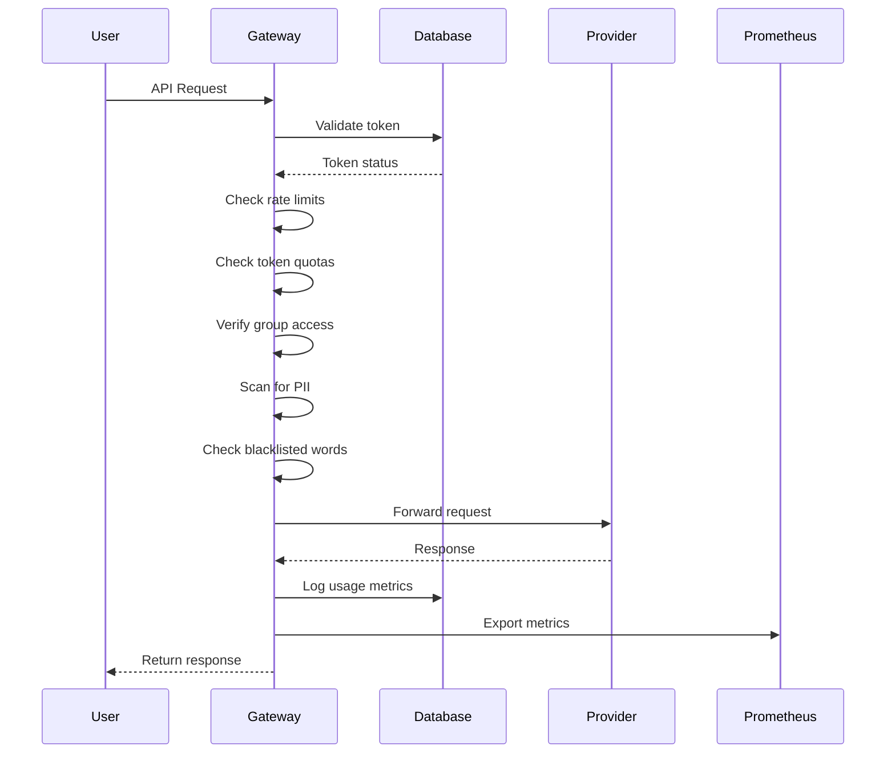

# Technical Architecture

## Ports Configuration

Burgonet Gateway uses several ports for different services:

| Port  | Service                     | Description                                                                 |
|-------|-----------------------------|-----------------------------------------------------------------------------|
| 6191  | Main Gateway Service        | Handles all API requests and routing (default)                             |
| 6192  | Prometheus Metrics          | Exposes monitoring metrics for scraping                                    |
| 11434 | Ollama Integration          | Used for local Ollama model inference                                       |
| 8001  | PII Protection Service      | External service for Personally Identifiable Information detection         |
| 8081  | llama.cpp Integration       | Used for local llama.cpp model inference                                    |

These ports can be configured in the `conf.yml` file:

```yaml
port: 6191  # Main gateway port
prometheus_port: 6192  # Metrics endpoint
```

## Request Flow



