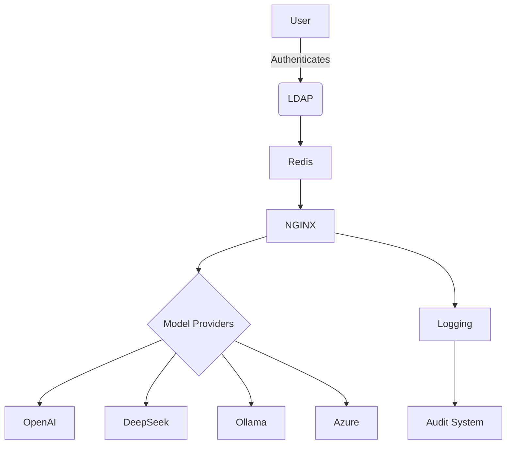
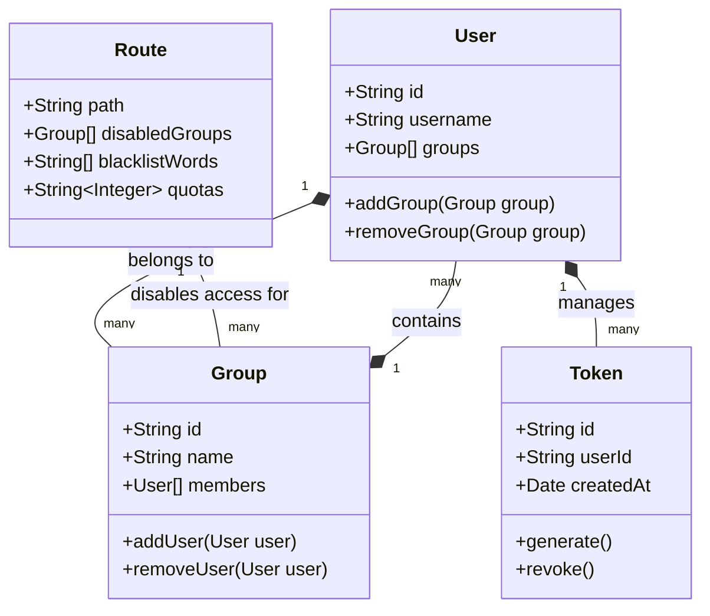
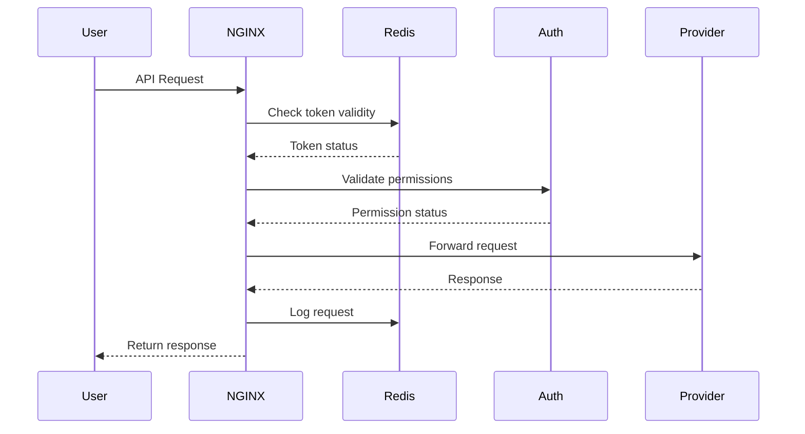

# Technical Architecture

## System Components



## Core Concepts



## Request Flow



## NGINX Integration

```
log_format bgn_combined escape=json '{' '"time_local":"$time_local",' '"remote_addr":"$remote_addr",' '"remote_user":"$remote_user",' '"request":"$request",' '"status": "$status",' '"body_bytes_sent":"$body_bytes_sent",' '"request_time":"$request_time",' '"http_referrer":"$http_referer",' '"http_user_agent":"$http_user_agent",' '"http_x_forwarded_for":"$http_x_forwarded_for",' '"host":"$host",' '"upstream_addr":"$upstream_addr",' '"request_method":"$request_method",' '"http_version":"$server_protocol",' '"request_body":"$request_body",' '"response_body":"$resp_body",' '"provider":"$provider",' '"model_name":"$model_name",' '"model_version":"$model_version"' '}';
server {
    listen 80;
    server_name _;
    set $resp_body '';
    body_filter_by_lua_file /etc/nginx/lua-scripts/body_filter.lua;
    location /api.deepseek.com/v3/chat/completions {
        set $apikey '';
        set $redis_host redis;
        set $redis_port 6379;
        set $model_name deepseek;
        set $model_version v3;
        access_by_lua_file /etc/nginx/lua-scripts/access.lua;
        proxy_pass https://api.deepseek.com;
        proxy_ssl_server_name on;
        proxy_set_header Host api.deepseek.com;
        proxy_set_header X-Real-IP $remote_addr;
        proxy_set_header X-Forwarded-For $proxy_add_x_forwarded_for;
        proxy_set_header X-Forwarded-Proto $scheme;
        proxy_set_header Content-Type $content_type;
        proxy_set_header Authorization 'Bearer $apikey';
        proxy_set_header Content-Length $content_length;
        proxy_pass_request_body on;
    }
    location /api.openai.com/v1/chat/completions {
        set $apikey '';
        set $redis_host redis;
        set $redis_port 6379;
        set $model_name gpt4o;
        set $model_version v3;
        access_by_lua_file /etc/nginx/lua-scripts/access.lua;
        proxy_pass https://api.openai.com;
        proxy_ssl_server_name on;
        proxy_set_header Host api.deepseek.com;
        proxy_set_header X-Real-IP $remote_addr;
        proxy_set_header X-Forwarded-For $proxy_add_x_forwarded_for;
        proxy_set_header X-Forwarded-Proto $scheme;
        proxy_set_header Content-Type $content_type;
        proxy_set_header Authorization 'Bearer $apikey';
        proxy_set_header Content-Length $content_length;
        proxy_pass_request_body on;
    }
    location /azure/gpt4o {
        set $apikey '';
        set $redis_host redis;
        set $redis_port 6379;
        set $model_name gpt4o;
        set $model_version v3;
        access_by_lua_file /etc/nginx/lua-scripts/access.lua;
        proxy_ssl_server_name on;
        proxy_set_header Host api.deepseek.com;
        proxy_set_header X-Real-IP $remote_addr;
        proxy_set_header X-Forwarded-For $proxy_add_x_forwarded_for;
        proxy_set_header X-Forwarded-Proto $scheme;
        proxy_set_header Content-Type $content_type;
        proxy_set_header Authorization 'Bearer $apikey';
        proxy_set_header Content-Length $content_length;
        proxy_pass_request_body on;
        set $endpoint https://YOUR_RESOURCE_NAME.openai.azure.com/openai/deployments/YOUR_DEPLOYMENT_ID-id/completions?api-version=2024-10-21;
        proxy_pass $endpoint;
    }
    location /ollama/gemma2/2b/ {
        set $apikey '';
        set $redis_host redis;
        set $redis_port 6379;
        set $model_name gemma2:2b-instruct-q6_K;
        set $model_version v3;
        access_by_lua_file /etc/nginx/lua-scripts/access.lua;
        proxy_pass http://m1:11434/api/chat;
        proxy_ssl_server_name on;
        proxy_set_header Host api.deepseek.com;
        proxy_set_header X-Real-IP $remote_addr;
        proxy_set_header X-Forwarded-For $proxy_add_x_forwarded_for;
        proxy_set_header X-Forwarded-Proto $scheme;
        proxy_set_header Content-Type $content_type;
        proxy_set_header Authorization 'Bearer $apikey';
        proxy_set_header Content-Length $content_length;
        proxy_pass_request_body on;
    }
}
```

