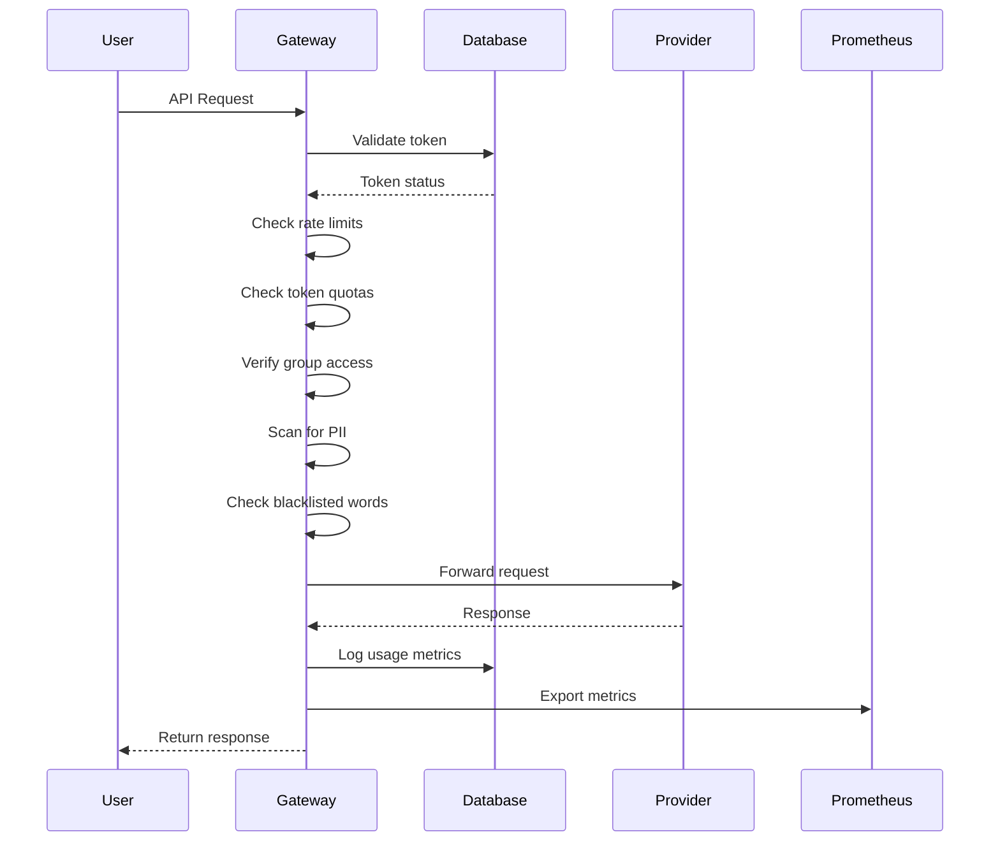

# Technical Architecture

## Request Flow

```mermaid
sequenceDiagram
    participant User
    participant Gateway
    participant Database
    participant Provider
    
    User->>Gateway: API Request
    Gateway->>Database: Validate token
    Database-->>Gateway: Token status
    Gateway->>Gateway: Check rate limits
    Gateway->>Gateway: Check token quotas
    Gateway->>Gateway: Verify group access
    Gateway->>Gateway: Scan for PII
    Gateway->>Gateway: Check blacklisted words
    Gateway->>Provider: Forward request
    Provider-->>Gateway: Response
    Gateway->>Database: Log usage metrics
    Gateway->>Prometheus: Export metrics
    Gateway-->>User: Return response
```

