# Technical Architecture

## Ports Configuration

Burgonet Gateway uses several ports for different services:

| Port | Service              | Description                                              |
|------|----------------------|----------------------------------------------------------|
| 6189 | Admin Service        | Provides web UI and API for configuration and monitoring |
| 6190 | Chat Service         | Chat web UI with local storage                           |
| 6191 | Main Gateway Service | Handles all API requests and routing (default)           |
| 6192 | Prometheus Metrics   | Exposes monitoring metrics for scraping                  |
| 6193 | Echo Service         | Echo used to configure and tests                         |

These ports can be configured in the `conf.yml` file:

```yaml
port: 6191  # Main gateway port
prometheus_port: 6192  # Metrics endpoint
```

## Request Flow

```mermaid
sequenceDiagram
    participant 🤓 User
    participant 🛡️ Gateway
    participant 💿 Database
    participant 💬 Provider
    
    🤓 User->>🛡️ Gateway: API Request
    🛡️ Gateway->>💿 Database: Validate token
    💿 Database-->>🛡️ Gateway: Token status
    🛡️ Gateway->>🛡️ Gateway: Check rate limits
    🛡️ Gateway->>🛡️ Gateway: Check token quotas
    🛡️ Gateway->>🛡️ Gateway: Verify group access
    🛡️ Gateway->>🛡️ Gateway: Scan for PII
    🛡️ Gateway->>🛡️ Gateway: Check blacklisted words
    🛡️ Gateway->>🛡️ Gateway: Forward request
    💬 Provider-->>🛡️ Gateway: Response
    🛡️ Gateway->>💿 Database: Log usage metrics
    🛡️ Gateway->>Prometheus: Export metrics
    🛡️ Gateway-->>🤓 User: Return response
```



